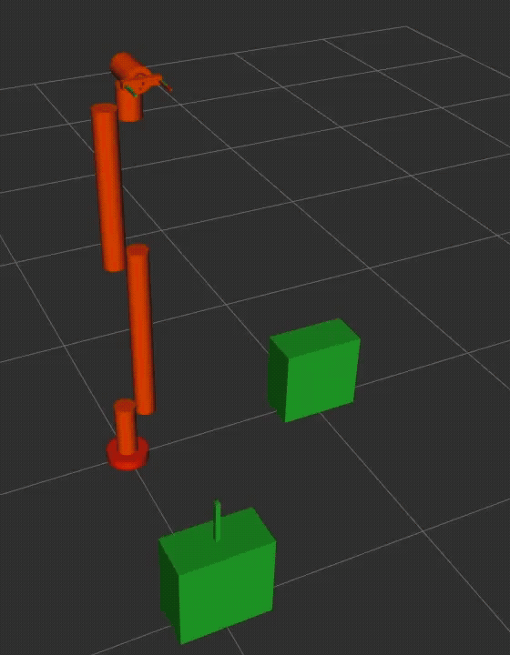

# 🤖 6-DOF Robotic Arm Simulation in Gazebo, RViz & MoveIt

This repository provides a ROS-based simulation of a 6-DOF robotic arm for pick-and-place operations. It uses **Gazebo** for realistic physics simulation, **RViz** for real-time visualization, and **MoveIt** for motion planning and trajectory execution. The robot is fully modeled using URDF and integrates with ROS control interfaces for trajectory execution.

---

## 🖼️ Demo

<table>
  <tr>
    <td rowspan="2" align="center">
      
    </td>
    <td align="center">
      
    </td>
  </tr>
  <tr>
    <td align="center">
      
    </td>
  </tr>
</table>

---

## 🔧 Features

- 6 Degrees of Freedom robotic manipulator
- Fully defined URDF model with joint limits and links
- Real-time visualization in **RViz**
- Physics-based simulation in **Gazebo**
- ROS control integration for joint commands
- Integrated with **MoveIt** for motion planning and trajectory control
- Intelligent **pick-and-place** routine using MoveIt planning pipelines
- Modular structure for extension and real-robot adaptation

## 🗒️ Note

- Add maintainer information at package.xml
- Ensure MoveIt configuration packages are included and sourced
