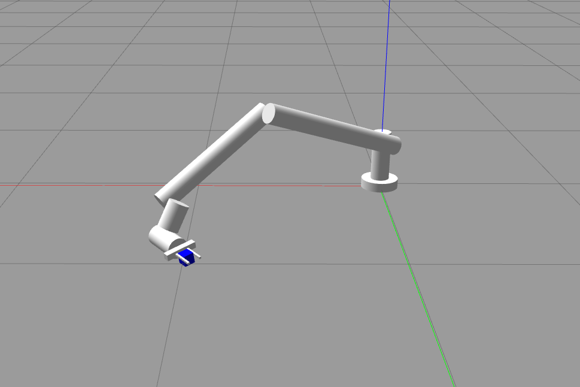

# 🤖 6-DOF Robotic Arm Simulation in Gazebo & RViz

This repository provides a ROS-based simulation of a 6-DOF robotic arm for pick-and-place operations. It uses **Gazebo** for realistic physics simulation and **RViz** for real-time visualization. The robot is fully modeled using URDF and integrates with ROS control interfaces for trajectory execution.

---

## 🖼️ Demo

  
  

---

## 🔧 Features

- 6 Degrees of Freedom robotic manipulator
- Fully defined URDF model with joint limits and links
- Real-time visualization in **RViz**
- Physics-based simulation in **Gazebo**
- ROS control integration for joint commands
- Basic **pick-and-place** routine
- Modular structure for extension and real-robot adaptation

## 🗒️ Note

- add maintainer information at package.xml
